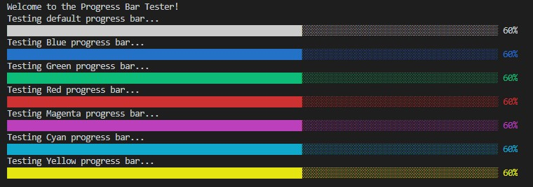

# Super Simple Progress Bar

A beautiful, easy to use progress bar for C++ console applications.

## API

The `progress_bar` class uses only the default constructor. In order to create the initial progress bar, call the `init()` function on your `progress_bar` instance. Then, as your program runs its operation, call the `update()` function with an integer value between 0 and 100 to indicate the percentage of the task that has been completed.

```cpp
progress_bar progress;

progress.init();
progress.update(25);
```

If you wish to use a colored progress bar, simply pass a valid console color escape sequence as a string into the `init()` function. The `colors` class provides shortcuts to the default and most widely available console foreground and background colors.

```cpp
colors colors;
progress_bar progress;

progress.init(colors.FgBlue);
progress.update(25);
```



## Test Program

If you would like to see the library in action, clone the repository and run the `run.sh` file in the '/examples' directory.

_Built using the Windows Subsystem for Linux._
